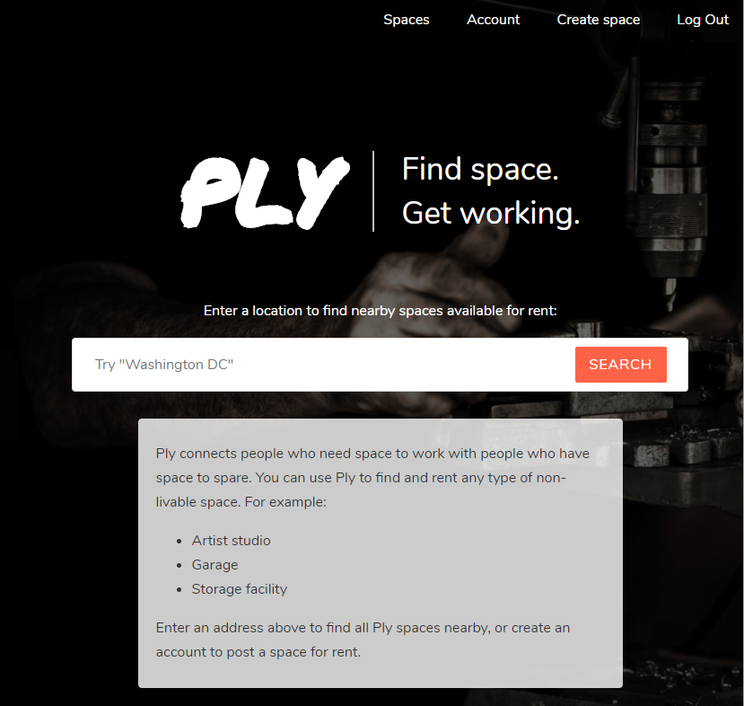

# ply
http://plyspace.herokuapp.com

ply connects people who have spare space with people who need space for a project or storage.

## Use cases

### Find and rent a workspace
An artist looking for studio space might want to rent an unused basement. An amateur mechanic who might just need to rent part of a garage for a couple of hours. A commuter might be interested in renting a parking space while its owner is at work. 

To find a space, simply search for the an address or city, and ply will show you all available spaces. 

### Make money by renting your spare space
Put your basement, attic, shed, or garage to work when you're not using them. Ply allows you rent space out by the hour, day, month, or for long term storage To post a space and start renting it out, just create an account and click 'create space'. Upload a picture, and fill in the details, and you're all set.

## Api documentation

### User endpoints

#### POST /user
  Creates a new user object. Req body (all fields required):
  {
    username: ,
    firstName: ,
    lastName: ,
    email: ,
    password
   }

#### POST api/login
  Creates user session for <username>. Req body(all fields required):
  {
    username: ,
    password: ,
  }
 
#### POST api/logout
  Logs out requesting user & redirects to '/'  
  
#### GET /api/user/_username_
  Returns user info for requested user (requires auth). Request body:
  {
    username: ,
    email: ,
    firstName: ,
    lastName
  }
  
#### PUT /api/user/_username_
  Updates user object (requires auth as that user, all fields optional). Request body:
  {
    email: ,
    firstName: ,
    lastName: ,
    password: ,
   }

#### DELETE /api/user/_username_
  Deletes user and spaces they own (requires auth as that user)
    
### Spaces endpoints

#### POST /api/find_spaces
  Returns spaces filtered by location, or by owner. To search by owner, request body:
  {
    username: ,
  }
  
  To search by location, request body (long and lat must be numbers (ints or floats): 
  {
    location: {
      coordinates: [ _longitude_, _latitude_]
    }
  }
  
  Returns array of space objects. Location search returns all spaces within ~10 miles of specified coordinates. Res body: 
  [
    {
      	spaceID: _used for url and for api requests re: space_,
	      title: ,
	      type: _e.g. 'Studio', 'Garage', etc._
	      owner: ,
	      description: ,
	      amenities: {
		      electricity: _Boolean_,
          heat: _Boolean_,
          water: _Boolean_,
          bathroom: _Boolean_
	      },
	      coverImage: _url of cover image_,	      
	      hourly: _true iff available for hourly rent_,
	      daily: _true iff available for daily rent_,
	      monthly: _true iff available for montly rent_,
	      longTerm: _true iff available for long term rent_,
	      location: {
		      type: 'Point',
		      coordinates: [ _longitude_, _latitidue_ ]
	      },
	      rates: {
          _unit of time_ : _rate per unit of time_
        },
	      street: ,
	      city: ,
	      state: ,
	      zip: 
    }
  ]
  
#### POST /api/spaces
  Creates a new space object (requires auth). Request body includes all fields listed above, except spaceID and owner.
  
#### PUT /api/spaces/_spaceID_
  Updates space object with id _spaceID_ (requires auth as owner). Request body includes any fields listed above, except spaceID and owner.
  
#### DELETE /api/spaces/_spaceID_
  Deletes space object with id _spaceID_ (requires auth as owner).

 
  

